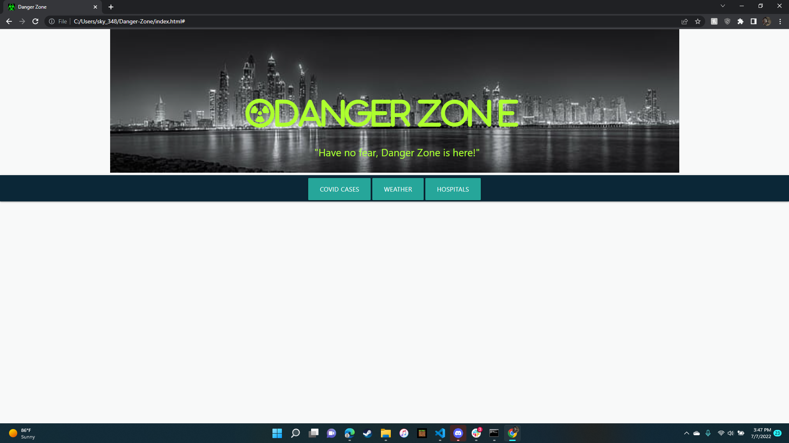

# Danger-Zone

overview

This app was created with the intention to help peple plan safer trips while they are in california. We used three apis that provide data on weather, covid cases per city, and nearest hospitals. we also used materialized instead of jquerry. 

link to git hub repository <a href=https://sklylerf.github.io/Danger-Zone/

link to git hub repository <a href=https://github.com/SklylerF/Danger-Zone